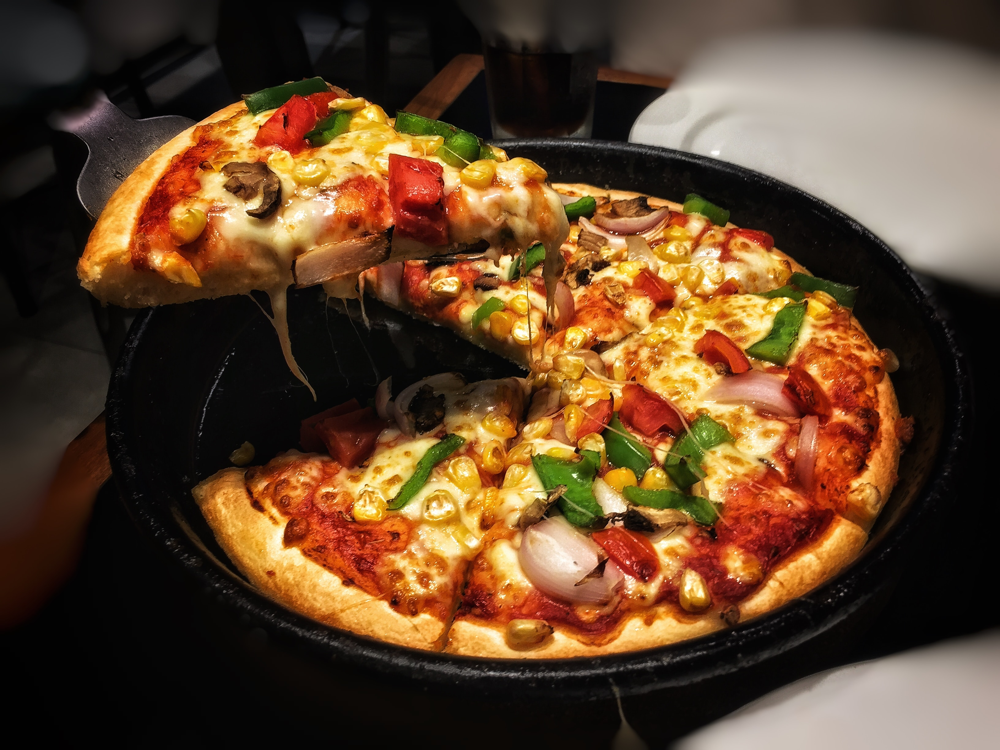

## Application Name
Neshco Pizza

## Description
This is website for ordering  pizza of different sizes and toppings depending on the customer's  preference.This project uses html and css to style,also bootstrap is used here.I also used jquery to make it responsive.

## Operating
To view the website please click the link provided above.
Then choose the pizza you want using the dropdown select option.
After selecting,choose whether you want it delivered or not.
On checking out a list will appear with the order summary.

## Technologies used
In this project we used HTML ,and to style I used bootstrap css.
We also used jquery to make the page more responsive.
We also created our own css stylesheet to change the background color and fonts.
We used google fonts to change our fonts. 

## Troubleshooting
If you encounter any problems please contact us with the contact details provided below.

## Support and contact details
Contact us on : 254-784756739
Email us on: Neshco@gmail.com

## Contributors
[marknesh]

## MIT License

Copyright (c) [2019] [marknesh]

Permission is hereby granted, free of charge, to any person obtaining a copy
of this software and associated documentation files (the "Software"), to deal
in the Software without restriction, including without limitation the rights
to use, copy, modify, merge, publish, distribute, sublicense, and/or sell
copies of the Software, and to permit persons to whom the Software is
furnished to do so, subject to the following conditions:

The above copyright notice and this permission notice shall be included in all
copies or substantial portions of the Software.

THE SOFTWARE IS PROVIDED "AS IS", WITHOUT WARRANTY OF ANY KIND, EXPRESS OR
IMPLIED, INCLUDING BUT NOT LIMITED TO THE WARRANTIES OF MERCHANTABILITY,
FITNESS FOR A PARTICULAR PURPOSE AND NONINFRINGEMENT. IN NO EVENT SHALL THE
AUTHORS OR COPYRIGHT HOLDERS BE LIABLE FOR ANY CLAIM, DAMAGES OR OTHER

